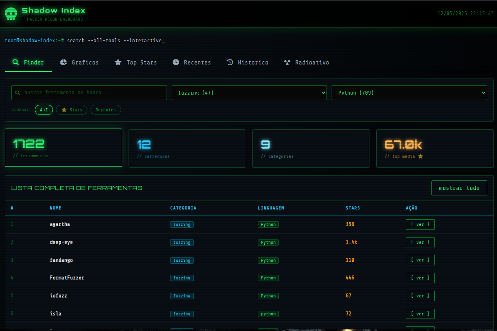

# Shadow Index


Shadow Index e a interface auxiliar que exibe, organiza e filtra os dados coletados pela aplicacao principal. Ela transforma o catalogo bruto em uma vitrine navegavel de ferramentas, estatisticas, rankings, historico de varreduras e monitoramento visual.

Descricao curta para GitHub:

Shadow Index e a camada visual do ecossistema OSINT: uma interface auxiliar para consultar ferramentas, explorar estatisticas e acompanhar os dados coletados em tempo real.

## Preview da plataforma



## O que esta aplicacao faz

1. Lista ferramentas com paginacao.
2. Permite busca por nome e descricao.
3. Permite filtro por categoria e linguagem.
4. Mostra ranking por stars e ferramentas recentes.
5. Exibe historico de varreduras.
6. Exibe aba Radioativo com monitoramento automatico de ferramentas.
7. Exibe graficos com distribuicao de dados.

## Como o projeto esta organizado

1. Frontend principal: `index.php`.
2. API em PHP: pasta `api/`.
3. Modulos de interface: pasta `modulos/` com separacao por aba (`finder`, `grafico`, `top-stars`, `recentes`, `historico`, `radioativo`).
4. Arquivos estaticos: pasta `assets/`.
5. Manifesto PWA: `manifest.webmanifest`.
6. Service Worker: `sw.js`.

## Requisitos para rodar

1. PHP 7.4 ou superior com extensao `mysqli` habilitada.
2. MySQL 5.7+ ou MariaDB 10+.
3. Servidor web (Apache, Nginx ou servidor embutido do PHP).

## Configuracao do ambiente

1. Crie o arquivo de ambiente:

```bash
cp .env.example .env
```

2. Preencha o arquivo `.env` com as credenciais do banco:

```env
DB_HOST=127.0.0.1
DB_PORT=3306
DB_NAME=osint_tools
DB_USER=seu_usuario
DB_PASSWORD=sua_senha
```

## Estrutura minima do banco

```sql
CREATE TABLE ferramentas (
  id INT AUTO_INCREMENT PRIMARY KEY,
  nome VARCHAR(255),
  url VARCHAR(512),
  descricao TEXT,
  linguagem VARCHAR(100),
  stars INT DEFAULT 0,
  topics TEXT,
  categoria VARCHAR(100),
  query VARCHAR(255),
  data_insercao DATETIME DEFAULT CURRENT_TIMESTAMP
);

CREATE TABLE varreduras (
  id INT AUTO_INCREMENT PRIMARY KEY,
  categoria VARCHAR(100),
  queries INT,
  quantidade_encontradas INT,
  quantidade_novas INT,
  quantidade_duplicadas INT,
  tempo_execucao_segundos DECIMAL(10,2),
  data_varredura DATETIME DEFAULT CURRENT_TIMESTAMP
);
```

## Como executar

Opcao 1: Servidor web local (Apache/Nginx)

1. Aponte o DocumentRoot para a pasta do projeto.
2. Acesse `http://localhost/` (ou rota equivalente no seu ambiente).

Opcao 2: Servidor embutido do PHP

1. Na pasta do projeto, execute:

```bash
php -S localhost:8080
```

2. Acesse `http://localhost:8080/index.php`.

## Como usar a aplicação

Esta seção explica como acessar e usar a Shadow Index em diferentes sistemas operacionais.

### Windows

#### Pré-requisitos
- PHP 7.4+ instalado
- MySQL/MariaDB instalado
- Um navegador web (Chrome, Firefox, Edge, etc.)

#### Passo a passo

1. **Configure o banco de dados:**
   - Abra o MySQL Workbench ou phpMyAdmin
   - Copie e execute o script SQL da seção "Estrutura mínima do banco"
   - Configure as credenciais no arquivo `.env`

2. **Inicie o servidor:**
   - Abra o Prompt de Comando (CMD) ou PowerShell
   - Navegue até a pasta do projeto:
     ```cmd
     cd C:\caminho\para\web
     ```
   - Execute o servidor PHP:
     ```cmd
     php -S localhost:8080
     ```

3. **Acesse a aplicação:**
   - Abra uma aba do navegador
   - Digite: `http://localhost:8080`
   - A página inicial com a lista de ferramentas aparecerá

4. **Use os recursos:**
   - **Buscar:** Digite o nome da ferramenta na barra de busca
   - **Filtro por categoria:** Selecione uma categoria no menu esquerdo
   - **Filtro por linguagem:** Clique em uma linguagem para filtrar ferramentas
   - **Top Stars:** Veja as ferramentas mais populares
   - **Recentes:** Confira as ferramentas adicionadas recentemente
   - **Histórico:** Acompanhe as varreduras realizadas
   - **Monitoramento:** Abra a aba Radioativo para monitoramento automático
   - **Gráficos:** Visualize estatísticas e distribuição dos dados

---

### macOS

#### Pré-requisitos
- PHP 7.4+ (macOS já vem com PHP pré-instalado)
- MySQL/MariaDB instalado (via Homebrew ou DMG)
- Um navegador web (Safari, Chrome, Firefox, etc.)

#### Passo a passo

1. **Verifique se o PHP está instalado:**
   ```bash
   php -v
   ```

2. **Configure o banco de dados:**
   - Abra o MySQL via Terminal:
     ```bash
     mysql -u root -p
     ```
   - Copie e execute o script SQL da seção "Estrutura mínima do banco"
   - Configure as credenciais no arquivo `.env`

3. **Inicie o servidor:**
   - Abra o Terminal (Aplicações > Utilitários > Terminal)
   - Navegue até a pasta do projeto:
     ```bash
     cd /caminho/para/web
     ```
   - Execute o servidor PHP:
     ```bash
     php -S localhost:8080
     ```

4. **Acesse a aplicação:**
   - Abra um navegador
   - Digite na barra de endereço: `http://localhost:8080`
   - A página inicial será exibida

5. **Use os recursos:**
   - **Buscar:** Digite o nome da ferramenta na barra de busca
   - **Filtro por categoria:** Selecione uma categoria no menu esquerdo
   - **Filtro por linguagem:** Clique em uma linguagem para filtrar ferramentas
   - **Top Stars:** Veja as ferramentas mais populares
   - **Recentes:** Confira as ferramentas adicionadas recentemente
   - **Histórico:** Acompanhe as varreduras realizadas
   - **Monitoramento:** Abra a aba Radioativo para monitoramento automático
   - **Gráficos:** Visualize estatísticas e distribuição dos dados

---

### Linux

#### Pré-requisitos
- PHP 7.4+ instalado
- MySQL/MariaDB instalado
- Um navegador web (Chrome, Firefox, etc.)

#### Passo a passo (Ubuntu/Debian)

1. **Instale os requisitos (se necessário):**
   ```bash
   sudo apt update
   sudo apt install php php-mysql php-cli -y
   sudo apt install mysql-server -y
   ```

2. **Configure o banco de dados:**
   - Abra o MySQL no Terminal:
     ```bash
     sudo mysql -u root -p
     ```
   - Copie e execute o script SQL da seção "Estrutura mínima do banco"
   - Configure as credenciais no arquivo `.env`

3. **Inicie o servidor:**
   - Abra um Terminal
   - Navegue até a pasta do projeto:
     ```bash
     cd /caminho/para/web
     ```
   - Execute o servidor PHP:
     ```bash
     php -S localhost:8080
     ```

4. **Acesse a aplicação:**
   - Abra um navegador
   - Digite na barra de endereço: `http://localhost:8080`
   - A página inicial será exibida

5. **Use os recursos:**
   - **Buscar:** Digite o nome da ferramenta na barra de busca
   - **Filtro por categoria:** Selecione uma categoria no menu esquerdo
   - **Filtro por linguagem:** Clique em uma linguagem para filtrar ferramentas
   - **Top Stars:** Veja as ferramentas mais populares
   - **Recentes:** Confira as ferramentas adicionadas recentemente
   - **Histórico:** Acompanhe as varreduras realizadas
   - **Monitoramento:** Abra a aba Radioativo para monitoramento automático
   - **Gráficos:** Visualize estatísticas e distribuição dos dados

#### Passo a passo (Red Hat/CentOS/Fedora)

1. **Instale os requisitos (se necessário):**
   ```bash
   sudo yum install php php-mysqnd php-cli -y
   sudo yum install mysql-server -y
   ```

2. **Configure o banco de dados:**
   - Inicie o serviço MySQL:
     ```bash
     sudo systemctl start mysql
     ```
   - Acesse o MySQL:
     ```bash
     mysql -u root -p
     ```
   - Copie e execute o script SQL da seção "Estrutura mínima do banco"
   - Configure as credenciais no arquivo `.env`

3. **Inicie o servidor:**
   - Abra um Terminal
   - Navegue até a pasta do projeto:
     ```bash
     cd /caminho/para/web
     ```
   - Execute o servidor PHP:
     ```bash
     php -S localhost:8080
     ```

4. **Acesse a aplicação:** (mesmo que Ubuntu/Debian)
   - Abra um navegador
   - Digite: `http://localhost:8080`

5. **Use os recursos:** (mesmo que Ubuntu/Debian)

---

## Dicas para melhor experiência

- **Elevar servidor com privilégios:** Se desejar usar portas menores que 1024:
  ```bash
  sudo php -S localhost:80
  ```

- **Acessar de outro computador:** Substitua `localhost` pelo IP da máquina:
  - Encontre seu IP com: `ipconfig` (Windows) ou `ifconfig` (Mac/Linux)
  - Acesse: `http://seu-ip:8080`

- **Ativar PWA:** A aplicação é compatível com Progressive Web App. Clique no ícone de instalação do navegador.

- **Service Worker offline:** A aplicação funciona parcialmente offline após o primeiro acesso.

---

## Endpoints principais da API

1. `GET /api/health.php`
2. `GET /api/stats.php`
3. `GET /api/ferramentas.php`
4. `GET /api/ferramentas-detalhes.php?id=...`
5. `GET /api/categorias.php`
6. `GET /api/por-linguagem.php`
7. `GET /api/top-stars.php`
8. `GET /api/recentes.php`
9. `GET /api/search.php?q=...`
10. `GET /api/varreduras.php`

## Observacoes de seguranca

1. O arquivo `.env` contem credenciais sensiveis e nao deve ser versionado.
2. O `.gitignore` do projeto ja ignora `.env`.

## Licenca

MIT.
